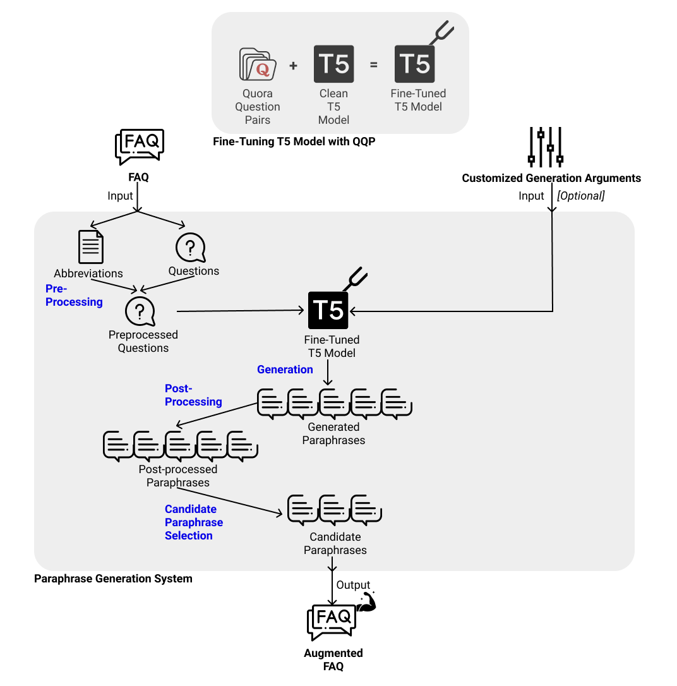
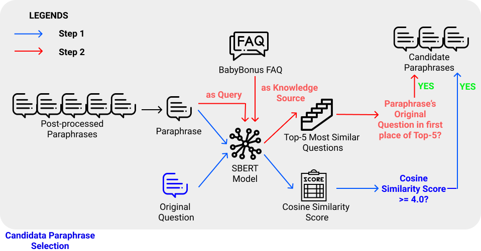

# Generate Domain-specific paraphrase of FAQ questions
### Table of Contents
1. [Introduction](#introduction)
2. [Disclaimer](#disclaimer)
3. [Author](#author)

## Introduction
This repository "t5_paraphrase_gen" is seamlessly integrated into the Bani generation pipeline, and serves to perform an end-to-end paraphrase generation of all the questions of a given FAQ dataset, while ensuring that paraphrases retain domain-specific terms and remains semantically similar to their original question.

To use this repository for the purpose of augmenting the FAQ dataset, you may instantiate the T5Generator as one of the producers passed into the GenerateManager. 
You may gain a more functional understanding of how T5Generator can be used in `t5_qqp_tutorial.ipynb`.

You may view the whole flow of the T5Generator by referring to 

Generated paraphrases will be filtered out in two main steps as described in greater details in 

Shortlisted paraphrases are known as candidate paraphrases, and are used to augment the given FAQ. 

## Disclaimer
I have tested and ran all the source code included in this repository using a 13" Macbook Pro (2020) running on macOS v11.2.1 with a Python version of 3.7.7.

As I do not have a working Windows PC in my possession, I have performed limited testing on a Windows distribution. If there are any errors, it is likely to be specific to the Windows distribution, as some discrepancies exist between MacOS and Windows such as the path string. Please do feel free to raise any issues, and I will provide my solutions promptly.

## Author
Ng Jing Rui for AY2020/2021 FYP

Submitted in Partial Fulfilment of the Requirements for the Degree of Bachelor of Computer Science and Engineering of the Nanyang Technological University

Under the guidance of Assoc. Prof Chng Eng Siong and his team that includes Damien Cheng, Thi Ly and Zin Tun